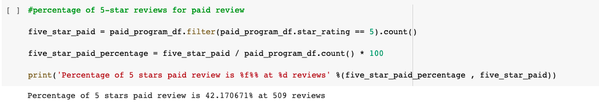
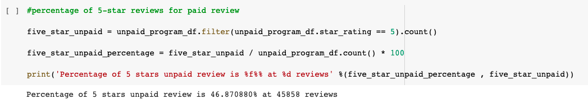

# Amazon Vine Analysis

## Background

Analyzing Amazon reviews written by members of the paid Amazon Vine program. The Amazon Vine program is a service that allows manufacturers and publishers to receive reviews for their products. Companies like SellBy pay a small fee to Amazon and provide products to Amazon Vine members, who are then required to publish a review.

## Overview of Project

### Purpose

In this project, you’ll have access to approximately 50 datasets. Each one contains reviews of a specific product, from clothing apparel to wireless products. You’ll need to pick one of these datasets and use PySpark to perform the ETL process to extract the dataset, transform the data, connect to an AWS RDS instance, and load the transformed data into pgAdmin. Next, you’ll use PySpark, Pandas, or SQL to determine if there is any bias toward favourable reviews from Vine members in your dataset. Then, you’ll write a summary of the analysis for Jennifer to submit to the SellBy stakeholders.

## Analysis And Challenges

## Methodology: Analytics Paradigm

#### 1. Decomposing the Ask

Find out if there is a biased

#### 2. Identify the Datasource
https://s3.amazonaws.com/amazon-reviews-pds/tsv/amazon_reviews_us_Kitchen_v1_00.tsv.gz
From this list: https://s3.amazonaws.com/amazon-reviews-pds/tsv/index.txt

### 3. Define Strategy & Metrics
**Resource:** Google Colab, PySpark, AWS RDS, AWS S3, Postgres 12

#### 4. Data Retrieval Plan
Stated in [2. Identify the Datasource](#2-identify-the-datasource)

#### 5. Assemble & Clean the Data
Create 4 dataframes from the dataset to fit in with our database tables:

#### 6. Analyse for Trends

#### 7. Acknowledging Limitations
The dataset is only limited to year 2015 so the trend might have changed since then.

#### 8. Making the Call:
The "Proper" Conclusion is indicated below on [Summary](#summary)

## Analysis

1. How many Vine reviews and non-Vine reviews were there?
There are
2.  How many Vine reviews were 5 stars? How many non-Vine reviews were 5 stars?
3. What percentage of Vine reviews were 5 stars? What percentage of non-Vine reviews were 5 stars?

>Paid 5 Stars

>Unpaid 5 Stars

## Summary

## Appendix

### References

Overview

https://www.analyticsvidhya.com/blog/2021/06/part-1-step-by-step-guide-to-master-natural-language-processing-nlp-in-python/

NLP Tutorial series

https://eugenia-anello.medium.com/nlp-tutorial-series-d0baaf7616e0

Python

https://www.analyticsvidhya.com/blog/2017/01/ultimate-guide-to-understand-implement-natural-language-processing-codes-in-python/
