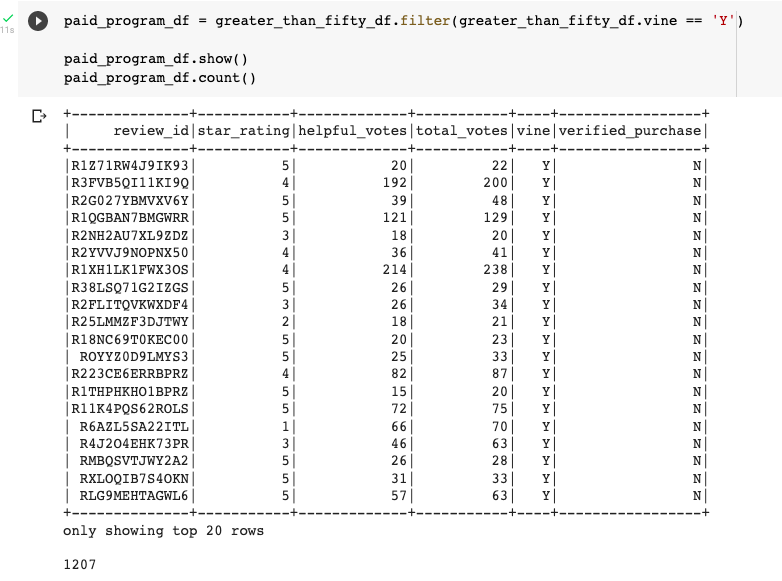
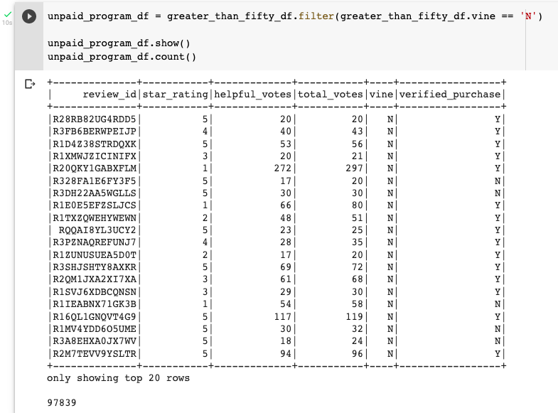
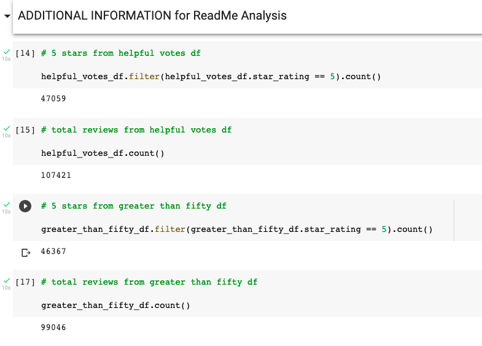

# Amazon Vine Analysis

## Background

Analyzing Amazon reviews written by members of the paid Amazon Vine program. The Amazon Vine program is a service that allows manufacturers and publishers to receive reviews for their products. Companies like SellBy pay a small fee to Amazon and provide products to Amazon Vine members, who are then required to publish a review.

## Overview of Project

### Purpose

In this project, you’ll have access to approximately 50 datasets. Each one contains reviews of a specific product, from clothing apparel to wireless products. You’ll need to pick one of these datasets and use PySpark to perform the ETL process to extract the dataset, transform the data, connect to an AWS RDS instance, and load the transformed data into pgAdmin. Next, you’ll use PySpark, Pandas, or SQL to determine if there is any bias toward favourable reviews from Vine members in your dataset. Then, you’ll write a summary of the analysis for Jennifer to submit to the SellBy stakeholders.

## Analysis And Challenges

## Methodology: Analytics Paradigm

#### 1. Decomposing the Ask

Determine if there is any bias toward favourable reviews from Vine members (paid reviews) in Amazon product reviews.

#### 2. Identify the Datasource
From this list: https://s3.amazonaws.com/amazon-reviews-pds/tsv/index.txt
* https://s3.amazonaws.com/amazon-reviews-pds/tsv/amazon_reviews_us_Kitchen_v1_00.tsv.gz

### 3. Define Strategy & Metrics
**Resource:** Google Colab, PySpark, AWS RDS, AWS S3, Postgres 12

#### 4. Data Retrieval Plan
1. Retrieve the Amazon Reviews dataset
2. Upload in my AWS S3 bucket
3. Call the S3 dataset from my Google Colab workbook
4. Assemble the data as indicated  in [5. Assemble & Clean the Data](#5-assemble--clean-the-data)
5. create database in Amazon RDS instance
6. create connection & corresponding server in Postgres
7. create database schema in Postgres database
8. From Google Colab, connect to the AWS RDS instance and populate the tables which will then populate the database tables in Postgres
* S3 --> Google Colab --> AWS RDS instance --> Postgres RDS

#### 5. Assemble & Clean the Data
Create 4 dataframes from the dataset to fit in with our database tables:
* review_id_table
* products_table
* customers_table
* vine_table

#### 6. Analyse for Trends

The analysis is indicated below in [Analysis](#analysis)

#### 7. Acknowledging Limitations
The dataset is only limited to year 2015 so the trend might have changed since then.

#### 8. Making the Call:
The "Proper" Conclusion is indicated below in [Summary](#summary)

## Analysis

1. How many Vine reviews and non-Vine reviews were there?

>Paid  Total Reviews

There is a total of _**1207 of paid reviews**_ that have received 20 or more helpful votes and those helpful votes are 50% or more than total votes.

>Unpaid  Total Reviews

There is a total of _**97839 of unpaid reviews**_ that have received 20 or more helpful votes and those helpful votes are 50% or more than total votes.

2.  How many Vine reviews were 5 stars? How many non-Vine reviews were 5 stars?
3. What percentage of Vine reviews were 5 stars? What percentage of non-Vine reviews were 5 stars?

>Percentage 5 Stars Paid

Percentage of 5 stars paid review is _**42.170671% at 509 5 stars reviews**_

>Percentage 5 Stars UnPaid

Percentage of 5 stars unpaid review is _**46.870880% at 45858 5 stars reviews**_

## Summary

Looking at the analysis of Amazon Kitchen reviews above, there is no positive bias in the Vine program as paid 5 stars reviews is at _**42% from total paid reviews**_ and unpaid reviews are at _**45% from total unpaid reviews.**_ This means the percentage of unpaid 5 stars reviews are more than paid 5 stars reviews.
From the total of 5 stars reviews for paid and unpaid program, Vine paid 5 stars is only 1% (509) of unpaid 5 stars reviews (45858).

>Additional Information

Currently there are _**107421 reviews that have received 20 or more helpful votes**_, see above. That means _**paid reviews is only 1% of the total helpful reviews**_ in this category.

Given the dataset above, I will propose additional analysis with NLP for the columns below:
1. review_headline: Title of Reviews
2. review_body: Review sentences

The above analysis will be able to give us customer sentiments on products and potential improvements and suggestions for the products above. Furthermore, it could also enable potentially new products to be invented that will solve their pain points.

## Appendix

### References

Overview

https://www.analyticsvidhya.com/blog/2021/06/part-1-step-by-step-guide-to-master-natural-language-processing-nlp-in-python/

NLP Tutorial series

https://eugenia-anello.medium.com/nlp-tutorial-series-d0baaf7616e0

Python

https://www.analyticsvidhya.com/blog/2017/01/ultimate-guide-to-understand-implement-natural-language-processing-codes-in-python/
